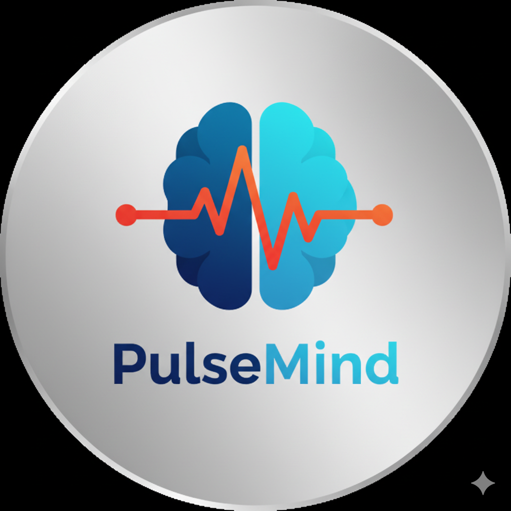

# PulseMind 🧠💙

<div align="center">
  
  
  ### *Your Personal Mental Wellness Companion*
  
  [](https://opensource.org/licenses/MIT)
  [](https://reactjs.org/)
  [](https://www.typescriptlang.org/)
  [](https://vitejs.dev/)
</div>

## 🌟 Overview

PulseMind is a comprehensive mental health and wellness platform that combines AI-powered therapy, mood tracking, mindfulness exercises, and personalized recommendations to support your mental well-being journey. Built with modern web technologies, PulseMind offers an intuitive and engaging experience for users seeking mental health support.

## ✨ Features

### 🤖 **AI-Powered Chat Therapy**
- Intelligent chatbot for 24/7 mental health support
- Personalized conversations based on mood and context
- Safe space for expressing thoughts and feelings

### 📊 **Mood Assessment & Tracking**
- Comprehensive mood evaluation system
- Visual mood tracking with calendar integration
- Progress monitoring and insights

### 🧘 **Therapy Sessions**
- **Audio Therapy**: Guided meditation and relaxation sessions
- **Physical Therapy**: Yoga and exercise routines
- **Laughing Therapy**: Curated content for mood enhancement
- **Reading Therapy**: Personalized book and article recommendations

### 👨‍⚕️ **Doctor Consultation**
- Professional consultation booking system
- Secure communication with licensed therapists
- Appointment scheduling and management

### 🎯 **Smart Recommendations**
- AI-driven content suggestions
- Personalized therapy recommendations
- Activity suggestions based on mood patterns

### 🔐 **Secure Authentication**
- Google OAuth integration
- Secure user profile management
- Privacy-focused data handling

## 🛠️ Tech Stack

### Frontend
- **React 18+** with TypeScript
- **Vite** for fast development and building
- **Tailwind CSS** for modern, responsive styling
- **Framer Motion** for smooth animations
- **React Router** for navigation

### Backend
- **Node.js** with Express.js
- **RESTful API** architecture
- **JWT** authentication

### Development Tools
- **ESLint** for code quality
- **PostCSS** for CSS processing
- **TypeScript** for type safety

### Additional Integrations
- **Google OAuth** for authentication
- **Vanta.js** for interactive backgrounds
- **Voice recognition** capabilities

## 🚀 Quick Start

### Prerequisites
- Node.js (v18+ recommended)
- npm or yarn package manager
- Modern web browser

### Installation

1. **Clone the repository**
   ```bash
   git clone https://github.com/PulseMind-AI/PulseMind.git
   cd PulseMind
   ```

2. **Install dependencies**
   ```bash
   npm install
   ```

3. **Set up environment variables**
   ```bash
   # Create .env file in root directory
   cp .env.example .env
   
   # Add your configuration:
   # VITE_GOOGLE_CLIENT_ID=your_google_client_id
   # VITE_API_URL=your_api_url
   ```

4. **Start development server**
   ```bash
   npm run dev
   ```

5. **Start backend server** (if running locally)
   ```bash
   cd server
   npm install
   npm start
   ```

6. **Open your browser**
   Navigate to `http://localhost:5173`

## 📁 Project Structure

```
PulseMind/
├── public/                 # Static assets
│   ├── images/            # Image resources
│   └── PulseMindlogo.png  # Brand logo
├── src/
│   ├── components/        # Reusable UI components
│   │   ├── Calendar.tsx
│   │   ├── MoodAssessment.tsx
│   │   ├── Notifications.tsx
│   │   └── ...
│   ├── pages/             # Application pages
│   │   ├── Home.tsx
│   │   ├── Login.tsx
│   │   ├── AudioTherapy.tsx
│   │   └── ...
│   ├── features/          # Feature-specific modules
│   │   ├── chat/          # Chat functionality
│   │   └── voice/         # Voice recognition
│   ├── context/           # React Context providers
│   ├── types/             # TypeScript type definitions
│   └── imgs/              # Application images
├── server/                # Backend server
└── configuration files    # Vite, TypeScript, etc.
```

## 🎯 Usage Guide

### Getting Started
1. **Sign Up/Login**: Create an account or log in with Google OAuth
2. **Complete Profile**: Set up your personal information and preferences
3. **Mood Assessment**: Take the initial mood evaluation
4. **Explore Features**: Navigate through different therapy options

### Key Workflows
- **Daily Check-in**: Use mood assessment for daily mental health tracking
- **Therapy Sessions**: Choose from audio, physical, or reading therapy
- **AI Chat**: Engage with the AI companion for instant support
- **Progress Tracking**: Monitor your mental health journey over time

## 🤝 Contributing

We welcome contributions to PulseMind! Here's how you can help:

1. **Fork the repository**
2. **Create a feature branch**
   ```bash
   git checkout -b feature/amazing-feature
   ```
3. **Commit your changes**
   ```bash
   git commit -m 'Add amazing feature'
   ```
4. **Push to the branch**
   ```bash
   git push origin feature/amazing-feature
   ```
5. **Open a Pull Request**

### Development Guidelines
- Follow TypeScript best practices
- Maintain code quality with ESLint
- Write meaningful commit messages
- Test your changes thoroughly

## 📄 License

This project is licensed under the MIT License - see the [LICENSE](LICENSE) file for details.

## 🆘 Support

If you need help or have questions:

- 📧 Email: support@pulsemind.ai
- 💬 GitHub Issues: [Create an issue](https://github.com/PulseMind-AI/PulseMind/issues)
- 📖 Documentation: [Wiki](https://github.com/PulseMind-AI/PulseMind/wiki)

## 🌟 Acknowledgments

- Thanks to all contributors who help make PulseMind better
- Special thanks to the mental health community for inspiration
- Built with ❤️ for better mental wellness

---

<div align="center">
  <strong>Made with 💙 by the PulseMind Team</strong>
  <br>
  <em>Supporting mental wellness, one pulse at a time</em>
</div>
